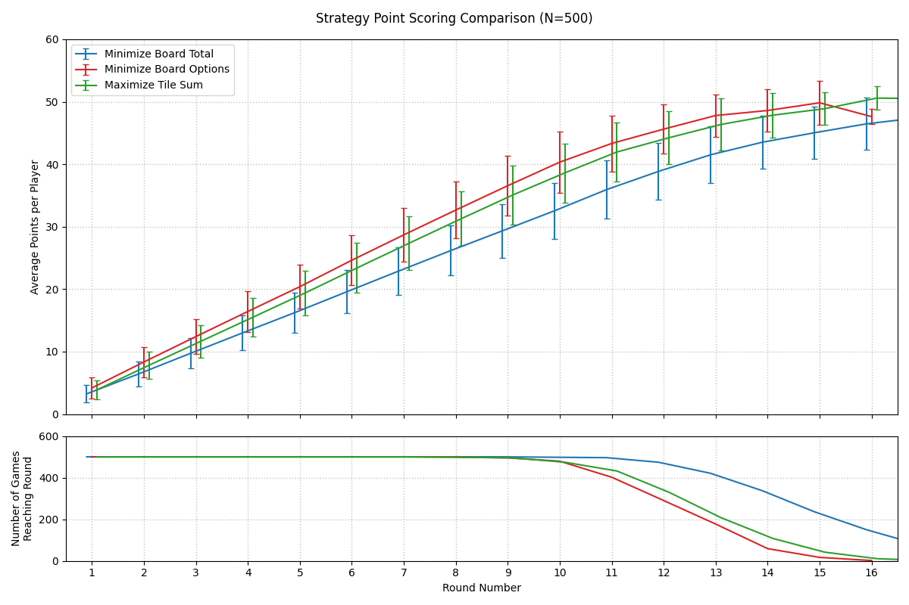
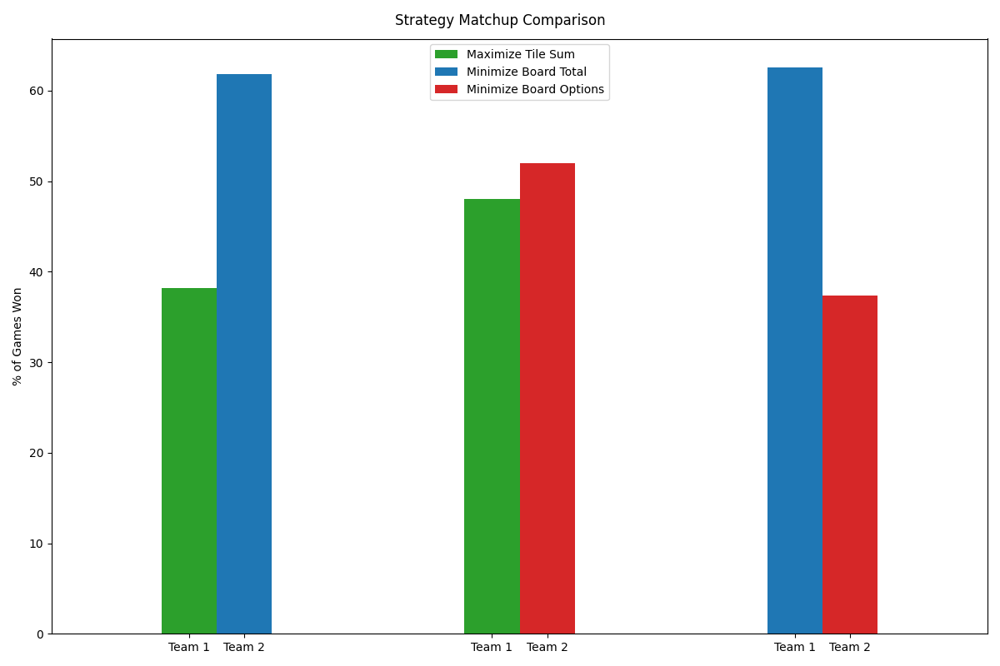
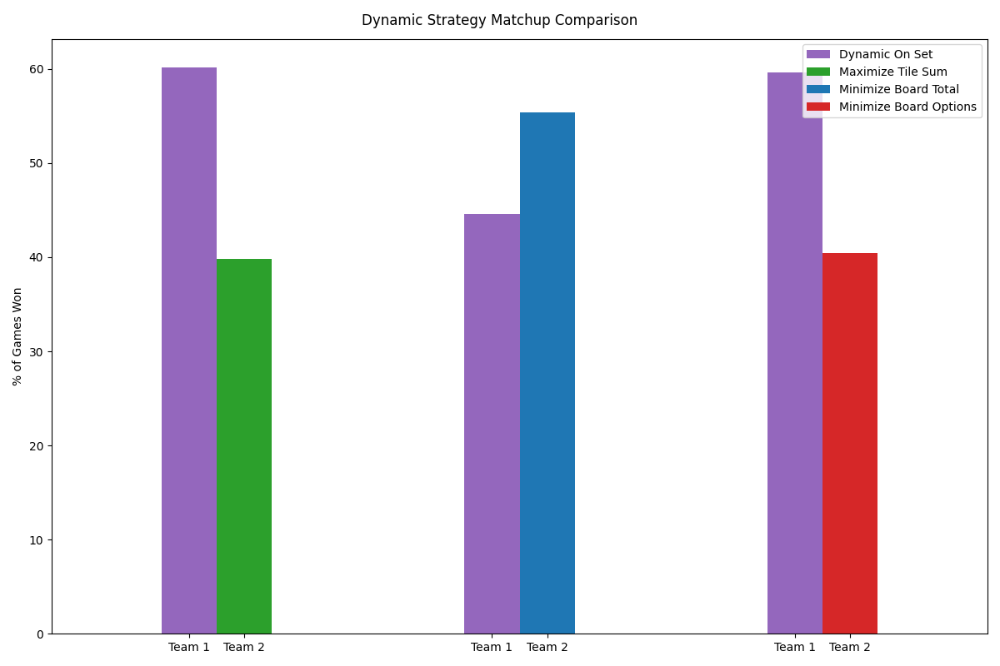
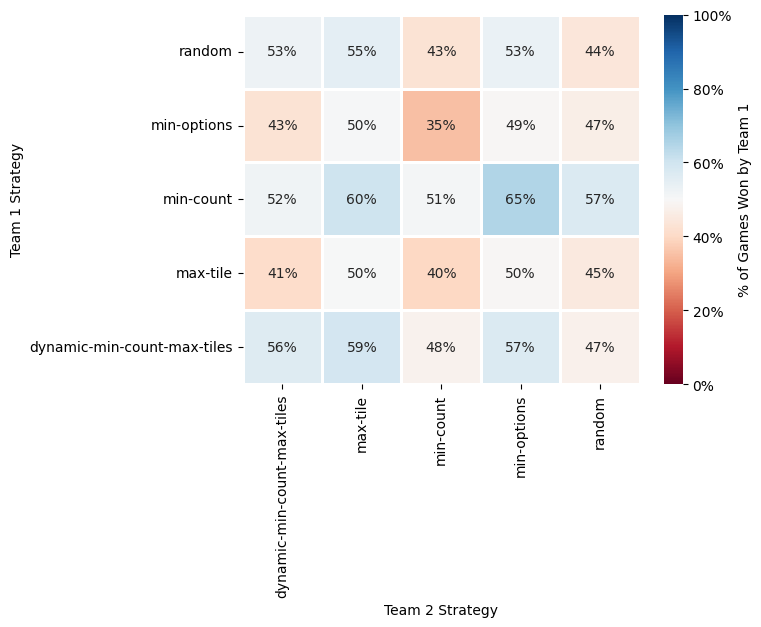
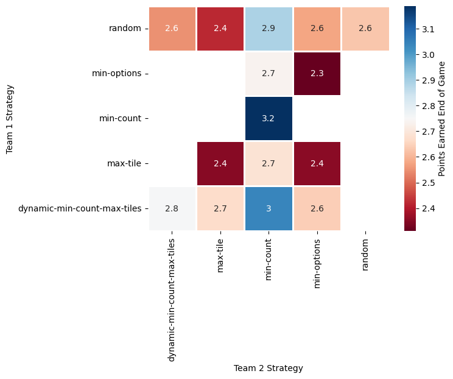

# Dominoes Monte Carlo Simulation and Analysis

## Background

Dominoes has been a game played by my family for as long as I can remember. Players begin each round by drawing 5 dominoes at random. Then at each player's turn, they must place a domino on the board so that the number of dots (pips) matches the domino it's attched to. Points are scored according to if the sum of the end pieces is a multiple of 5, and the points will be that multiple of 5 (i.e. 20 dots on the outside gives 4 points). Usually, it's played with 2 teams of 2 sitting across from one another. A round ends when a player runs out of tiles, they'll then receive the number of points as the sum of the opponents' tiles rounded to the nearest 5, divided by 5. There are other rules and procedures which you can read about [here](https://www.pagat.com/domino/cross/all_fives.html) if you're interested (in writing this I've discovered this variant is known as All-Fives or "Muggins"). 

I've long been curious about how much of the game comes down to randomness versus skill. Assuredly, a significant portion of the amount one can score depends on the pieces they draw at the beginning, as well as what others have played, but as is the case for the Law of Large Numbers, playing enough rounds and games usually results in the better performer winning, although it's often difficult to tell. I wanted to put this to the test, primarily as a challenge for me to program the logic of the game on my own, but also to simulate thousands of full games each filled with many rounds to see how different strategies compare for my own playing. For each strategy, I Monte Carlo simulated 500 games and calculated means and uncertainties alongside other data products including round winners and points scored during each round. As you'd imagine, every conceivable edge case emerged. Outcomes are fully reproducible as all random seeds are set deterministically. While I've had other ideas, this project is a smaller one and I intend to limit the scope. The primary Python script used for all simulation is `scripts/domino_script.py`. This repository shows my results and visualizations comparing them.

The strategies tested occur when a player cannot score using the dominoes in their hand; otherwise, it was programmed so that the player always scores the highest number of points for their team, as most players would do. They are as follows:
- **Minimize Board Total (min-count):** The player puts down the tile that minimizes the total count on the board so that the next player, who's not on their team, cannot score as many points as they would otherwise.
- **Minimize Board Options (min-options):** In this case, they will put down the peace that best matches the others on the board, so that the next player has fewer end piece options to play off. If a player doesn't have a piece, they must go to the "boneyard" until they can, which leaves the other team with more possible points if to gain at the end of the round if they go out first. 
- **Maximize Tile Sum (max-tile):** The player will simply put down their largest tile in the hopes that if the other team goes out first, they will gain fewer points when counting the other team's remaining tiles as they've gotten rid of the largest.
- **Dynamic On Set (dynamic-min-count-max-tiles):** On set means that assuming the player doesn't have to go to the boneyard, they'll go out first and collect the points from the other team's tiles. The player on set can change many times. For this strategy, if the player is on set, they'll minimize the count on the board so the next team has fewer options and if they're not, they'll put down their highest piece to get rid of it.
- **Random (random):** Meant to serve as a control group, this is exactly what it sounds like. Of the tiles they are able to play, they'll choose one at random. 

### Results

I began by looking at how points were scored differently depending on different strategies. Games consist of as many rounds as it takes for the first team to reach a certain amount of points, in my case I chose 100 somewhat arbitrarily since I couldn't remember the exact value. The figure below shows the number of points scored per player per round on the top and where games usually end on the bottom. Unsurprisingly, the strategy of minimizing the total on the board results in fewer points scored and longer games on average.

Different strategies were compared in competition in matchups between Team 1 (players 1 and 3) and Team 2 (players 2 and 4) where each team tried a different tactic. The following plots show some of these matchups and the percent of games one by each team over the 500. The results were rather surprising, indicating that minimizing the board total consistently outcompeted the other choices. My assumption going in was that the dynamic strategy would clearly be the most optimal, but these results point to the contrary. I hypothesize that against **Maximize Tile Sum**, **Minimize Board Total** minimized the next player's possible points while larger point opportunities were given to their own team. Against **Minimize Board Options**, I imagine it extends the game longer while also providing high scoring opportunities during the game for the teammate.

    
    

In testing every matchup individually, I found that the majority of strategies fare relatively even with one another. The heatmap depicts the win % for Team 1. It further emphasizes that minimizing the count on the board to minimize the number of points being scored during the round helps immensely. 

Finally, I looked at how many of the points scored by the winner of a round were scored at the end as the other team's leftover tiles were awarded as points to the winning team. We see that for the dominant min-count, more points were scored at the end on average compared to other matchups, indicating a more passive approach may provide better outcomes in the long run. 

### Conclusion

The primary purpose of the project was to challenge myself in simulating a game I enjoy playing with my family. No use of Artificial Intelligence was had, primarily because it was intended to sharpen my skills further and think critically on the details. AI is an incredibly valuable tool for productivity that I utilize when writing bulk code that's easily checkable, but I find it encouraging to return to manual problem-solving when applicable.

The Monte Carlo strategy-by-strategy approach was interesting, but certainly didn't represent the playstyle of most players in reality who play by more heuristic means. The most successful Domino players pay attention to not only what they have, but also what others have already play and would likely play, counting high and low tiles as someone would in Blackjack. Therefore, the largely chance based conclusions of this project do not apply to competetive playstyles, although I intend to learn from what I've gathered at the small scale. 